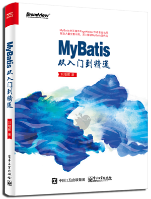

# 新书《MyBatis 从入门到精通》

我在CSDN博客写了不少和MyBatis相关的博客，2015年时觉得自己写的太零散，不够系统全面，所以在GitBook创建了一本名为MyBatis最佳实践的开源电子书，当时写好了目录大纲，由于维护好几个开源项目，业余时间几乎都被占用，最终也只写了MyBatis Generator部分，也就是博客中的[MyBatis Generator 详解](http://blog.csdn.net/isea533/article/details/42102297)。2016年3月份时，博文视点的孙奇俏编辑和我联系，然后就开始了 MyBatis 相关书籍的编写。

本书的内容和各种实践源自于和广大开发人员的交流，特别感谢大家的建议和帮助！

> 欢迎大家通过GitHub，使用Issues方式进行交流：
>
> Issues地址：https://github.com/mybatis-book/book/issues 

## 简介

本书中从一个简单的 MyBatis 查询入手，搭建起学习 MyBatis 的基础开发环境。通过全面的示例代码和测试讲解了在 MyBatis XML 方式和注解方式中进行增、删、改、查操作的基本用法，介绍了动态 SQL 在不同方面的应用以及在使用过程中的最佳实践方案。针对 MyBatis 高级映射、存储过程和类型处理器提供了丰富的示例，通过自下而上的方法使读者更好地理解和掌握MyBatis 的高级用法，同时针对 MyBatis 的代码生成器提供了详细的配置介绍。此外，本书还提供了缓存配置、插件开发、Spring、Spring Boot  集成的详细内容。最后通过介绍 Git  和 GitHub 让读者了解MyBatis 开源项目，通过对 MyBatis 源码和测试用例的讲解让读者更好掌握 MyBatis。

## 购买地址



购买地址：[京东](https://item.jd.com/12103309.html)，[当当](http://product.dangdang.com/25098208.html)，[亚马逊](https://www.amazon.cn/MyBatis从入门到精通-刘增辉/dp/B072RC11DM/ref=sr_1_18?ie=UTF8&qid=1498007125&sr=8-18&keywords=mybatis)

除了平台自营外，大家还可以搜索第三方卖家，选择价钱合适的购买。

## 资源下载

### [simple-start](./simple-start)

书中第一章的源码，是一个学习 MyBatis 的基础环境。

### [simple-all](./simple-all)

书中基本用法、动态SQL、拦截器、高级用法的完整源码。

在 mybatis-spring-boot 项目中引用了本项目。

### [mybatis-spring](./mybatis-spring)

MyBatis 和 Spring 集成的项目。

### [mybatis-spring-boot](./mybatis-spring-boot)

MyBatis 和 Spring Boot 集成的项目。

>除了以上 4 个项目外，还有 mybatis 源码等内容，可以通过 http://mybatis.tk 获取。

## 本书内容

全书共11 章，每一章的具体内容如下。

### 第1 章 MyBatis 入门

本章先简单介绍了 MyBatis 的发展历史和特点，然后通过一步步的操作搭建了一个学习 MyBatis 的基础环境，这个开发环境也是学习后续几个章节的基础。

### 第2 章 MyBatis XML 方式的基本用法

本章设定了一个简单的权限控制需求，使用 MyBatis XML 方式实现了数据库中一个表的常规操作。在查询方面，通过根据主键查询和查询全部两个方法让读者在学会使用 MyBatis 查询方法的同时，还深入了解 MyBatis 返回值的设置原理。在增、删、改方面提供了大量详细的示例，这些示例覆盖了MyBatis 基本用法的方方面面。

### 第3 章 MyBatis 注解方式的基本用法

虽然 XML 方式是主流，但是仍然有许多公司选择了注解方式，因此本章非常适合使用注解方式的读者。本章使用注解方式几乎实现了同XML 方式类似的全部方法，包含许多常用注解的基本用法。对于初学者来说，即使不使用注解方式，通过本章和第2 章的对比也可以对 MyBatis 有更深的了解。

### 第4 章 MyBatis 动态 SQL

本章详细介绍了MyBatis 最强大的动态 SQL 功能，通过丰富的示例讲解了各种动态 SQL 的用法，为动态 SQL 中可能出现的问题提供了最佳实践方案，还提供了动态 SQL 中常用的OGNL 用法。

### 第5 章 MyBatis 代码生成器

本章介绍的MyBatis 代码生成器可以减轻基本用法中最繁重的那部分书写工作带来的压力。通过本章的学习，可以使用代码生成器快速生成大量基础的方法，让大家更专注于业务代码的开发，从枯燥的基础编码中解脱出来。

### 第6 章 MyBatis 高级查询

本章介绍了MyBatis 中的高级结果映射，包括一对一映射、一对多映射和鉴别器映射。通过循序渐进的代码示例让读者轻松地学会使用MyBatis 中最高级的结果映射。本章还通过全面的示例讲解了存储过程的用法和类型处理器的用法。

### 第7 章 MyBatis 缓存配置

本章讲解了MyBatis 缓存配置的相关内容，提供了EhCache 缓存和Redis 缓存的集成方法。虽然二级缓存功能强大，但是使用不当很容易产生脏数据。本章针对脏数据的产生提供了最佳解决方案，并且介绍了二级缓存适用的场景。

### 第8 章 MyBatis 插件开发

本章介绍了MyBatis 强大的扩展能力，利用插件可以很方便地在运行时改变MyBatis 的行为。通过两个插件示例让读者初窥门径，结合第11 章的内容可以让读者开发出适合自己的插件。

### 第9 章 Spring 集成MyBatis

本章介绍了最流行的轻量级框架Spring 集成MyBatis 的方法，通过一步步操作从零开始配置，搭建一个基本的Spring、Spring MVC、MyBatis 开发环境。

### 第10 章 Spring Boot 集成MyBatis

本章介绍了最流行的微服务框架Spring Boot 集成MyBatis 的方法，通过MyBatis 官方提供的starter 可以很方便地进行集成。同时，本章对starter 中的配置做了简单的介绍，可以满足读者对MyBatis 各项配置方面的需要。

### 第11 章 MyBatis 开源项目

本章是一扇通往开源世界的大门，也是一扇通往 MyBatis 源码学习的大门。从 Git 入门到GitHub 入门，读者可以学会使用最流行的分布式版本控制系统和源代码托管服务。通过一段代码让大家了解 MyBatis 中的一部分关键类，通过代码包讲解可以了解MyBatis 每个包中所含的功能。最后通过MyBatis 丰富的测试用例为读者提供更多更有用的学习内容。


## 试读内容 - 第4章 MyBatis 动态 SQL

### 4.4 `foreach` 用法

SQL语句中有时会使用`IN`关键字，例如`id in (1,2,3)`。可以使用`${ids}`的方式直接获取值，但这种写法不能防止 SQL 注入，想避免 SQL 注入就需要用`#{}`的方式，这时就要配合使用 `foreach` 标签满足需求。

`foreach` 可以对数组、`Map` 或实现了 `Iterable` 接口（如 `List`、`Set`）的对象进行遍历。数组在处理时会转换为 `List` 对象进行处理，因此 `foreach` 遍历的对象可以分为两大类：`Iterable` 类型和 `Map` 类型。这两种类型在遍历循环时情况不一样，这一节会通过3个例子来讲解 `foreach` 的用法。

#### 4.4.1 `foreach` 实现 in 集合

`foreach` 实现 `in` 集合（或数组）是最简单和常用的一种情况，下面介绍如何根据传入的用户 `id` 集合查询出所有符合条件的用户。首先在 `UserMapper` 接口中增加如下方法。

``` java
/**
 * 根据用户id集合查询
 * 
 * @param idList
 * @return
 */
List<SysUser> selectByIdList(List<Long> idList);
```

在 UserMapper.xml 中增加如下代码。

``` xml
<select id="selectByIdList" resultType="tk.mybatis.simple.model.SysUser">
    select id, 
        user_name userName, 
        user_password userPassword,
        user_email userEmail,
        user_info userInfo,
        head_img headImg,
        create_time createTime
    from sys_user
    where id in
    <foreach collection="list" open="(" close=")" separator="," item="id" index="i">
        #{id}
    </foreach>
</select>
```

`foreach` 包含以下属性。

-   `collection`：必填，值为要迭代循环的属性名。这个属性值的情况很多。

-   `item`：变量名，值为从迭代对象中取出的每一个值。

-   `index`：索引的属性名，在集合数组情况下值为当前索引值，当迭代循环的对象是 `Map` 类型时，这个值为 `Map` 的key（键值）。

-   `open`：整个循环内容开头的字符串。

-   `close`：整个循环内容结尾的字符串。

-   `separator`：每次循环的分隔符。

`collection` 的属性要如何设置呢？来看一下 MyBatis 是如何处理这种类型的参数的。

**1. 只有一个数组参数或集合参数**

以下代码是 `DefaultSqlSession` 中的方法，也是默认情况下的处理逻辑。

``` java
private Object wrapCollection(final Object object) {
    if (object instanceof Collection) {
        StrictMap<Object> map = new StrictMap<Object>();
        map.put("collection", object);
        if (object instanceof List) {
            map.put("list", object);
        }
        return map;
    } else if (object != null && object.getClass().isArray()) {
        StrictMap<Object> map = new StrictMap<Object>();
        map.put("array", object);
        return map;
    }
    return object;
}
```

当参数类型为 `Collection` 的时候，默认会转换为 `Map` 类型，并添加一个 key 为 `collection` 的值（MyBatis 3.3.0版本增加），如果参数类型是 `List` 集合，那么就继续添加一个 key 为 `list` 的值（MyBatis 3.2.8及低版本只有这一个key），这样，当`collection="list"`时，就能得到这个集合，并对它进行循环操作。

当参数类型为 `Array` 的时候，也会转换成 `Map` 类型，默认的 key 为 `array`。当采用如下方法使用数组参数时，就需要把`foreach` 标签中的 `collection` 属性值设置为 `array`。

``` java
/**
 * 根据用户id集合查询
 * 
 * @param idArray
 * @return
 */
List<SysUser> selectByIdList(Long[] idArray);
```

上面说是数组或集合类型的参数默认的名字，推荐使用`@Param`来指定参数的名字，这时 `collection` 就设置为通过`@Param`注解指定的名字。

**2. 有多个参数**

第 2 章中讲过，当有多个参数的时候，要使用`@Param`注解给每个参数指定一个名字，否则在 SQL 中使用参数时就会不方便。因此将`collection` 设置为 `@Param` 注解指定的名字即可。

**3. 参数是 `Map` 类型**

使用 `Map` 和使用`@Param`注解方式类似，将 `collection` 指定为对应 `Map` 中的 key 即可。如果要循环所传入的 `Map`，推荐使用`@Param`注解指定名字，此时可将 `collection` 设置为指定的名字，如果不想指定名字，就要使用默认值`_parameter`。

**4. 参数是一个对象**

指定为对象的属性名即可。当使用对象内多层嵌套的对象时，使用`属性.属性`（集合和数组可以使用下标取值）的方式可以指定深层的属性值。

先来看一个简单的测试代码，验证以上说法。

``` java
@Test
public void testSelectByIdList(){
    SqlSession sqlSession = getSqlSession();
    try {
        UserMapper userMapper = sqlSession.getMapper(UserMapper.class);
        List<Long> idList = new ArrayList<Long>();
        idList.add(1L);
        idList.add(1001L);
        //业务逻辑中必须校验idList.size() > 0
        List<SysUser> userList = userMapper.selectByIdList(idList);
        Assert.assertEquals(2, userList.size());
    } finally {
        //不要忘记关闭sqlSession
        sqlSession.close();
    }
}
```

该测试输出的日志如下。

``` properties
DEBUG [main] - ==> Preparing: select id, user_name userName,
                                     user_password userPassword,
                                     user_email userEmail,
                                     user_info userInfo,
                                     head_img headImg,
                                     create_time createTime
                              from sys_user
                              where id in ( ? , ? )
DEBUG [main] - ==> Parameters: 1(Long), 1001(Long)
TRACE [main] - <== Columns: id, userName, userPassword, userEmail,
                            userInfo, headImg, createTime
TRACE [main] - <== Row: 1, admin, 123456, admin@mybatis.tk,
                        <<BLOB>>, <<BLOB>>, 2016-06-07 00:00:00.0
TRACE [main] - <== Row: 1001, test, 123456, test@mybatis.tk,
                        <<BLOB>>, <<BLOB>>, 2016-06-07 00:00:00.0
DEBUG [main] - <== Total: 2
```

可以观察日志中打印的SQL语句，foreach元素中的内容最终成为了`in ( ? , ? )`，根据这部分内容很容易就能理解 `open`、`item`、`separator` 和 `close` 这些属性的作用。

关于不同集合类型参数的相关内容，建议大家利用上面的基础方法多去尝试，帮助更好地理解。

#### 4.4.2 `foreach` 实现批量插入

如果数据库支持批量插入，就可以通过 `foreach` 来实现。批量插入是SQL-92新增的特性，目前支持的数据库有 DB2、SQL Server 2008 及以上版本、PostgreSQL 8.2 及以上版本、MySQL、sqlite 3.7.11 及以上版本、H2。批量插入的语法如下。

``` sql
INSERT INTO tablename (column-a, [column-b, ...])
VALUES ('value-1a', ['value-1b', ...]),
       ('value-2a', ['value-2b', ...]),
       ...
```

从待处理部分可以看出，后面是一个值的循环，因此可以通过 `foreach` 实现循环插入。

在 `UserMapper` 接口中增加如下方法。

``` java
/**
 * 批量插入用户信息
 * 
 * @param userList
 * @return
 */
int insertList(List<SysUser> userList);
```

在 UserMapper.xml 中添加如下 SQL。

``` xml
<insert id="insertList">
    insert into sys_user(
        user_name, user_password,user_email,
        user_info, head_img, create_time)
    values
    <foreach collection="list" item="user" separator=",">
        (
        #{user.userName}, #{user.userPassword},#{user.userEmail},
        #{user.userInfo}, #{user.headImg, jdbcType=BLOB}, #{user.createTime, jdbcType=TIMESTAMP})
    </foreach>
</insert>
```

**注意**：通过 `item` 指定了循环变量名后，在引用值的时候使用的是`属性.属性`（如 `user.userName`）的方式。

针对该方法编写测试如下。

``` java
@Test
public void testInsertList(){
    SqlSession sqlSession = getSqlSession();
    try {
        UserMapper userMapper = sqlSession.getMapper(UserMapper.class);
        //创建一个user对象
        List<SysUser> userList = new ArrayList<SysUser>();
        for(int i = 0; i < 2; i++){
            SysUser user = new SysUser();
            user.setUserName("test" + i);
            user.setUserPassword("123456");
            user.setUserEmail("test@mybatis.tk");
            userList.add(user);
        }
        //将新建的对象批量插入数据库中，特别注意，这里的返回值result是执行SQL影响的行数
        int result = userMapper.insertList(userList);
        Assert.assertEquals(2, result);
    } finally {
        //为了不影响数据库中的数据导致其他测试失败，这里选择回滚
        sqlSession.rollback();
        //不要忘记关闭sqlSession
        sqlSession.close();
    }
}
```

为了使输出的日志不那么长，这里就测试插入两条数据的情况，输出的日志如下。

``` properties
DEBUG [main] - ==> Preparing: insert into sys_user(
                              		user_name, user_ password,
                              		user_email, user_info,
                              		head_img, create_time)
                              values ( ?, ?,?, ?, ?, ?) ,
                              	     ( ?, ?,?, ?, ?, ?)
DEBUG [main] - ==> Parameters: test0(String), 123456(String),
                               test@mybatis.tk(String),
                               null, null, null,
                               test1(String), 123456(String),
                               test@mybatis.tk(String),
                               null, null, null
DEBUG [main] - <== Updates: 2
```

从日志中可以看到通过批量SQL语句插入了两条数据。

从 MyBatis 3.3.1 版本开始，MyBatis 开始支持批量新增回写主键值的功能（该功能由本书作者提交），这个功能首先要求数据库主键值为自增类型，同时还要求该数据库提供的 JDBC 驱动可以支持返回批量插入的主键值（JDBC 提供了接口，但并不是所有数据库都完美实现了该接口），因此到目前为止，可以完美支持该功能的仅有 MySQL 数据库。由于 SQL Server 数据库官方提供的 JDBC 只能返回最后一个插入数据的主键值，所以不能支持该功能。

如果要在 MySQL 中实现批量插入返回自增主键值，只需要在原来代码基础上做如下修改。

``` xml
<insert id="insertList" useGeneratedKeys="true" keyProperty="id">
```

和单表一样，增加了`useGeneratedKeys`和`keyProperty`两个属性，增加这两个属性后，简单修改测试类，输出 `id` 值。

```
//在调用insertList之后
for(SysUser user : userList){
    System.out.println(user.getId());
}
```

执行测试后，可以看到id部分的日志如下。

``` properties
1023
1024
```

关于批量插入的内容就介绍这么多，对于不支持该功能的数据库，许多人会通过 `select...union all select...` 的方式去实现，这种方式不同数据库的实现也不同，并且这种实现也不安全，这里不再提供示例。

#### 4.4.3 `foreach` 实现动态UPDATE

这一节主要讲当参数类型是 `Map` 时，`foreach` 如何实现动态 UPDATE 。

当参数是 `Map` 类型的时候，`foreach` 标签的 `index` 属性值对应的不是索引值，而是 `Map` 中的 key，利用这个 key 可以实现动态 UPDATE。

现在需要通过指定的列名和对应的值去更新数据，实现代码如下。

``` xml
<update id="updateByMap">
    update sys_user 
    set 
    <foreach collection="_parameter" item="val" index="key" separator=",">
        ${key} = #{val}
    </foreach>
    where id = #{id}
</update>
```

这里的 key 作为列名，对应的值作为该列的值，通过 `foreache` 将需要更新的字段拼在 SQL 语句中。

该 SQL 对应在 `UserMapper` 接口中的方法如下。

``` java
/**
 * 通过Map更新列
 * 
 * @param map
 * @return
 */
int updateByMap(Map<String, Object> map);
```

这里没有通过`@Param`注解指定参数名，因而MyBatis在内部的上下文中使用了默认值`_parameter`作为该参数的key，所以在XML中就使用了`_parameter`。编写测试代码如下。

``` java
@Test
public void testUpdateByMap(){
    SqlSession sqlSession = getSqlSession();
    try {
        UserMapper userMapper = sqlSession.getMapper(UserMapper.class);
        Map<String, Object> map = new HashMap<String, Object>();
        //查询条件，同样也是更新字段，必须保证该值存在
        map.put("id", 1L);
        //要更新的其他字段
        map.put("user_email", "test@mybatis.tk");
        map.put("user_password", "12345678");
        //更新数据
        userMapper.updateByMap(map);
        //根据当前id查询修改后的数据
        SysUser user = userMapper.selectById(1L);
        Assert.assertEquals("test@mybatis.tk", user.getUserEmail());
    } finally {
        //为了不影响数据库中的数据导致其他测试失败，这里选择回滚
        sqlSession.rollback();
        //不要忘记关闭sqlSession
        sqlSession.close();
    }
}
```

测试代码输出日志如下。

``` properties
DEBUG [main] - ==> Preparing: update sys_user
                              set user_email = ? ,
                              	  user_password = ? ,
                                  id = ?
                              where id = ?
DEBUG [main] - ==> Parameters: test@mybatis.tk(String),
                               12345678(String),
                               1(Long),
                               1(Long)
DEBUG [main] - <== Updates: 1
DEBUG [main] - ==> Preparing: select * from sys_user where id = ?
DEBUG [main] - ==> Parameters: 1(Long)
TRACE [main] - <== Columns: id, user_name, user_password, user_email,
                            user_info, head_img, create_time
TRACE [main] - <== Row: 1, admin, 12345678, test@mybatis.tk,
                        <<BLOB>>, <<BLOB>>, 2016-06-07 00:00:00.0
DEBUG [main] - <== Total: 1
```

到这里，`foreach` 的全部内容就介绍完了，下一节将介绍 `bind` 的用法。

### 4.5 `bind` 用法

`bind` 标签可以使用 OGNL 表达式创建一个变量并将其绑定到上下文中。在前面的例子中，UserMapper.xml 有一个`selectByUser` 方法，这个方法用到了 `like` 查询条件，部分代码如下。

``` xml
<if test="userName != null and userName != ''">
and user_name like concat('%', #{userName}, '%')
</if>
```

使用 `concat` 函数连接字符串，在 MySQL 中，这个函数支持多个参数，但在 Oracle 中只支持两个参数。由于不同数据库之间的语法差异，如果更换数据库，有些 SQL 语句可能就需要重写。针对这种情况，可以使用 `bind` 标签来避免由于更换数据库带来的一些麻烦。将上面的方法改为 `bind` 方式后，代码如下。

``` xml
<if test="userName != null and userName != ''">
    <bind name="userNameLike" value="'%' + userName + '%'"/>
    and user_name like #{userNameLike}
</if>
```

`bind` 标签的两个属性都是必选项，`name` 为绑定到上下文的变量名，`value` 为 OGNL 表达式。创建一个 `bind` 标签的变量后，就可以在下面直接使用，使用 `bind` 拼接字符串不仅可以避免因更换数据库而去修改 SQL，也能预防 SQL 注入。大家可以根据需求，灵活使用 OGNL 表达式来实现功能，关于更多的 OGNL 常用的表达式，会在 4.7 节中详细介绍。


## 联系作者

由衷地感谢大家购买此书，希望大家会喜欢，也希望这本书能够为各位读者带来所希望获得的知识。虽然我已经非常细心地检查书中所提到的所有内容，但仍有可能存在疏漏，若大家在阅读过程中发现错误，在此我先表示歉意。欢迎各位读者对本书的内容和相关源代码发表意见和评论。大家可以通过我的个人邮箱abel533@gmail.com 与我取得联系，我会一一解答每个人的疑惑。


## 公众号

关注公众号可以获取更多 MyBatis 相关信息。

